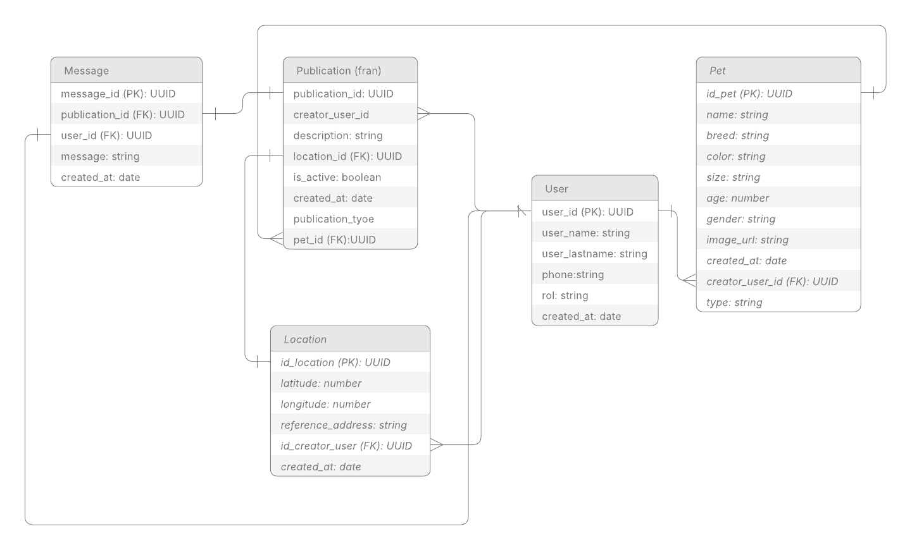
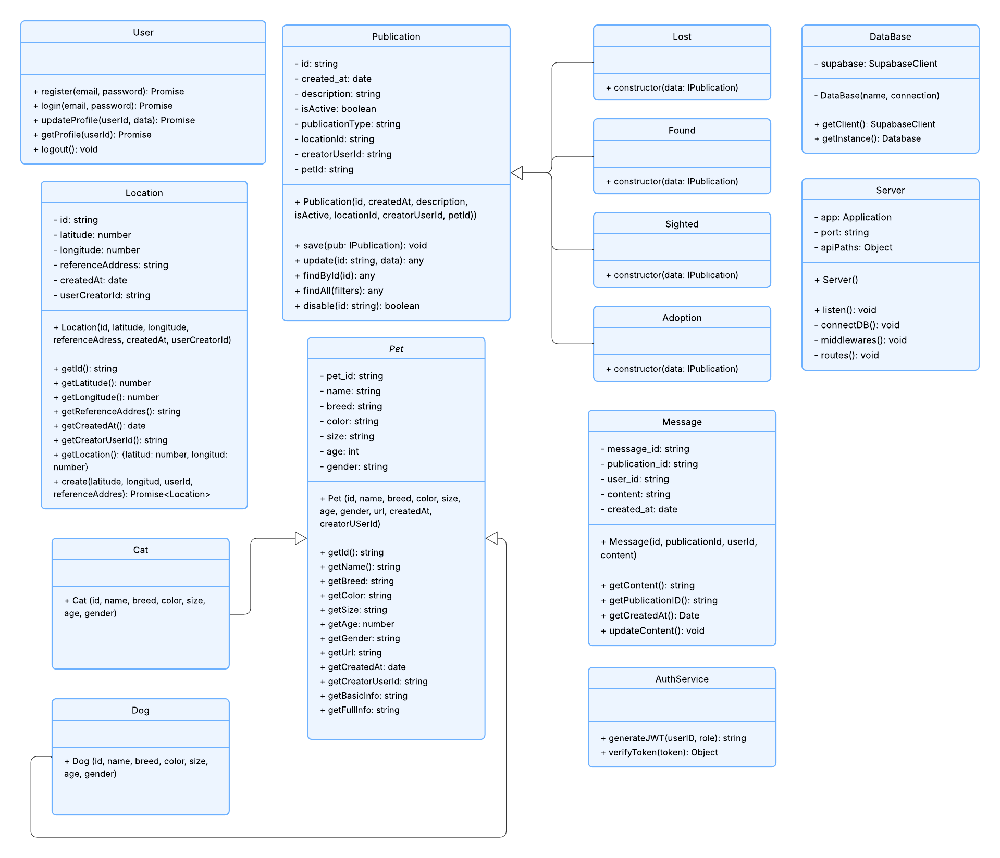

# Plataforma de Mascotas Perdidas (MichiMapp)

## Integrantes del Grupo 20

* Canclini Lucía
* Rodrigo Alvarez Balboa
* Franco Juarez Acherielli

## 1. Introducción y Objetivos

Este proyecto es una aplicación backend (API REST) desarrollada en **Node.js y TypeScript** que centraliza y organiza información sobre mascotas perdidas, encontradas y en adopción. El objetivo principal es desarrollar una herramienta accesible que aumente la efectividad en la localización de animales.

El desarrollo se basa en la aplicación rigurosa de **Patrones de Diseño** y los principios **SOLID** para crear un sistema más mantenible, flexible y extensible.

### **Tecnologías Clave**

* **Backend:** Node.js, Express.js (TypeScript)
* **Base de Datos:** PostgreSQL (gestionada por Supabase)
* **Capa de Persistencia:** Cliente de Supabase
* **Autenticación:** Supabase Auth + JWT
* **Validación:** Zod (schemas de validación)
* **Utilidades:** UUID, CORS
* **Control de Calidad:** Husky + lint-staged + Prettier (hook `pre-commit`)
* **Gestión de Repositorio:** GitHub para gestión de repositorios.
---

## 2. Guía de Inicio Rápido (Quickstart)

Esta sección explica cómo levantar el entorno de desarrollo local y garantizar la **reproducibilidad** del entorno.

### 2.1. Requisitos Previos

1.  **Node.js**.
2.  **Gestor de paquetes** NPM.
3.  Acceso a un proyecto **Supabase** activo.

### 2.2. Configuración e Instalación de Dependencias

1.  **Clonar el repositorio:**

    ```bash
    git clone https://github.com/Franco-Juarez/Metodolog-a-de-Sistemas
    cd Metodolog-a-de-Sistemas
    ```

2.  **Instalar dependencias:**

    ```bash
    npm install
    ```

3.  **Configurar Variables de Entorno:**

    Cree un archivo **`.env`** en la raíz del proyecto y complete las variables necesarias.

    ```env
    SUPABASE_URL=
    SUPABASE_ANON_KEY=
    JWT_SECRET=
    PORT=3000
    ```

### 2.3. Ejecución

Para iniciar el servidor en modo desarrollo (con recarga automática):

```bash
npm run dev
# Esto ejecuta: tsx watch src/server.ts
```

Si todo es correcto, se verá el mensaje: ✅ Base de datos conectada
🚀 Servidor corriendo en http://localhost:3000

### 2.4. Testing de la API

Para probar las rutas de la API, consulte el archivo **[Michimapp_Test.md](./Michimapp_Test.md)**, donde se encuentran ejemplos de solicitudes HTTP para todas las funcionalidades del sistema (registro, login, publicaciones, mensajes, etc.).

### 2.5. Control de Calidad del Código (Husky + Prettier)

Para garantizar la consistencia del código (estilo uniforme), se configuró Husky para que ejecute automáticamente Prettier en cada git commit.

Husky Hook: pre-commit

Propósito: Formatear y asegurar que el código no contenga errores de estilo antes de permitir el commit. Esto es clave para la Colaboración en equipo y la creación de un código más mantenible.

## 3. Estructura del Código Fuente

El proyecto sigue una estructura modular diseñada para cumplir con el **SRP** (separación de responsabilidades) y modularizar la lógica de los patrones.

```txt
src/
├── controllers/
│   ├── Message.Controller.ts
│   ├── Publication.Controller.ts
│   └── User.Controller.ts
│
├── middlewares/
│   └── auth.middleware.ts
│
├── models/
│   ├── pets/
│   │   ├── Cat.Class.ts
│   │   ├── Dog.Class.ts
│   │   ├── Pet.Class.ts
│   │   └── PetFactory.ts
│   │
│   ├── publications/
│   │   ├── Adoption.Class.ts
│   │   ├── Found.Class.ts
│   │   ├── Lost.Class.ts
│   │   ├── Publication.Builder.ts
│   │   ├── Publication.Class.ts
│   │   ├── Publication.Factory.ts
│   │   ├── Publication.interface.ts
│   │   └── Sighted.Class.ts
│   │
│   ├── AuthService.Class.ts
│   ├── DataBase.Class.ts
│   ├── Location.Class.ts
│   ├── Message.Class.ts
│   ├── Server.Class.ts
│   └── User.Class.ts
│
├── routes/
│   ├── Message.Routes.ts
│   ├── Publications.Routes.ts
│   └── User.Routes.ts
│
├── utils/
│   └── validators.ts
│
└── server.ts
```
## 4. Diseño y Diagramas de Arquitectura

### 4.1. Diagrama de Entidad-Relación (ER)
El siguiente diagrama define la estructura de la base de datos (tablas y relaciones de entidad) utilizada para la persistencia del proyecto.




### 4.2. Diagrama de Clases (UML)
Este diagrama ilustra la arquitectura orientada a objetos, incluyendo la jerarquía de Polimorfismo y la estructura de los Patrones Creacionales.



## 5. Rutas Principales del Backend

| Módulo        | Endpoint / Acción                          | Descripción |
|---------------|----------------------------------------------|-------------|
| **Users**     | POST /api/users/register                     | Registro de usuario. |
|               | POST /api/users/login                        | Login y obtención de token JWT. |
|               | GET /api/users/profile (auth)                | Obtener perfil del usuario autenticado. |
|               | PUT /api/users/profile (auth)                | Actualizar perfil del usuario. |
|               | GET /api/users/me/publications (auth)        | Obtener publicaciones del usuario autenticado. |
| **Publications** | POST /api/publications (auth)             | Crear una publicación (lost, found, sighted, adoption). |
|               | GET /api/publications                        | Obtener todas las publicaciones activas. |
|               | GET /api/publications?type&user&age&size     | Filtrar publicaciones por parámetros. |
|               | GET /api/publications/:id                    | Obtener publicación por ID específico. |
|               | PUT /api/publications/:id (auth)             | Actualizar publicación (descripción, estado). |
|               | DELETE /api/publications/:id (auth)          | Desactivar publicación (solo el creador). |
| **Messages**  | POST /api/messages (auth)                    | Crear mensaje/comentario en una publicación. |
|               | GET /api/messages/publication/:publicationId | Obtener mensajes de una publicación específica. |
|               | PUT /api/messages/:id (auth)                 | Actualizar mensaje. |
|               | DELETE /api/messages/:id (auth)              | Eliminar mensaje. |
|


## 6. Documentación de Arquitectura (Patrones)

### 6.1 Implementación guiada por la necesidad de crear un código **fácil de entender, mantener y extender**.

Se utilizó la Arquitectura en Capas con **MVC** (Modelo Vista-Controlador) que incluye:

1. Separación de Responsabilidades: El proyecto separa claramente modelos (models/), controladores (controllers/), y vistas, facilitando el mantenimiento y escalabilidad.

2. Implementación de **Patrón Singleton** en **models/DataBase.Class.ts**. Se utilizó para garantizar que exista una única conexión activa a la base de datos en todo el sistema. Esto evita la creación de conexiones múltiples, centraliza la gestión de este recurso y permite controlar la dependencia de infraestructura, impidiendo que el resto de los módulos lo instancien directamente con new.

3. Implementación de **Patrón Builder** en **models/publications/Publication.Builder.ts** porque Es útil para construir objetos complejos como publicaciones, donde se combinan múltiples parámetros (foto, especie, raza, ubicación, estado, comentarios). Separa la lógica de construcción, lo que permite armar objetos con muchas combinaciones de parámetros opcionales, evitando constructores con demasiados parámetros y facilitando formularios dinámicos. En síntesis simplifica la creación de objetos complejos (Publicaciones) y mejora la claridad del código.

4. Implementación de **Patrón Factory Method** en **models/pets/PetFactory.ts** y **models/publications/Publication.Factory.ts**. Este patrón permite crear instancias de diferentes tipos de objetos (Dog/Cat para mascotas, Lost/Found/Sighted/Adoption para publicaciones) sin especificar las clases concretas. El Factory encapsula la lógica de creación y decisión, facilitando la extensibilidad cuando se requiera agregar nuevos tipos (por ejemplo, otras especies de mascotas o nuevos tipos de publicaciones) sin modificar el código existente que los utiliza.

5. Escalabilidad: La estructura modular permite agregar nuevos tipos de publicaciones, autores o funcionalidades sin afectar componentes existentes.

6. Mantenibilidad: Cada componente tiene una responsabilidad única y bien definida, reduciendo el acoplamiento y facilitando cambios futuros.

7. Reutilización: Los patrones implementados promueven la reutilización de código y evitan duplicación de lógica.

Esta arquitectura fue elegida porque el dominio del problema requiere flexibilidad para manejar diferentes tipos de entidades manteniendo un código organizado y fácil de entender.


### 6.2 Clean Code: Cohesión y Legibilidad
1. Cohesión de Responsabilidades, por ejemplo la eliminación de Setters (Inmutabilidad). Al eliminar los setters de las entidades (Pet.Class.ts), se garantiza que el estado de los objetos de dominio es inmutable una vez creados. Esto previene cambios de estado inesperados y simplifica el debugging, lo cual es una práctica clave de Clean Code.

Encapsulamiento del JSON (Builder): El patrón Builder (Publication.Builder.ts) encapsula el proceso de construcción, haciendo que el código del cliente sea más fácil de leer, ya que no tiene que preocuparse por el orden o la validación de los 10+ parámetros del objeto.

2. Legibilidad y Uniformidad (Prettier/Husky)
El setup de Husky y Prettier garantiza la uniformidad del código del equipo.

Clean as You Code: El hook pre-commit asegura que el código sea formateado y limpiado antes de que ingrese al historial de Git. Este control automatizado es la defensa más efectiva contra la acumulación de Deuda Técnica en forma de desorden de estilo y errores de sintaxis.

### 6.3. Patrones de Comportamiento (Para Implementar a Futuro)

| Patrón    | Dónde se Aplicará                 | Justificación |
|-----------|------------------------------------|---------------|
| **Observer** | Módulo de Notificaciones | El sistema notificará automáticamente a los usuarios suscritos (Observers) cuando haya una nueva publicación (Subject). Esto permite una relación dinámica y desacoplada. |
| **Strategy** | Módulo de Búsquedas y Filtros | Permite aplicar distintas estrategias de ordenamiento o filtros. El algoritmo es intercambiable en tiempo de ejecución sin modificar la clase principal de búsqueda. |


---